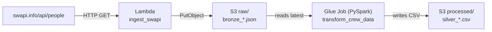

# AWS Serverless Data Pipeline

A small medallion-architecture pipeline on AWS: a Lambda lands raw JSON from a public API into S3, and a Glue job running PySpark cleans it into a analysis-ready CSV.

[Versión en español](#versión-en-español) · [Detailed walkthrough (ES)](docs/PIPELINE.es.md)



## What it does

**Bronze (`src/lambda/ingest_swapi.py`)** — calls the SWAPI people endpoint and writes the untouched response to `s3://<bucket>/raw/bronze_<prefix>_<timestamp>.json`. Nothing is parsed at this stage, so the raw payload stays replayable.

**Silver (`src/glue/transform_crew_data.py`)** — picks the most recent bronze file, then applies six transformations in PySpark:

| # | Transformation |
|---|---|
| 1 | Select the eight fields that matter, tolerating a missing column |
| 2 | `normalized_birth_year` — parse `"19BBY"` into a plain year |
| 3 | `mass_lb` — convert kilograms to pounds, keeping `unknown` as null |
| 4 | `gender_id` — map to `M` / `F` / `N` |
| 5 | Drop outliers above 1000 kg |
| 6 | Drop rows missing three or more fields |

The output lands as one CSV at `s3://<bucket>/processed/silver_crew_data_<timestamp>.csv`, reusing the bronze timestamp so any silver file traces back to the exact payload it came from.

## Orchestration

Two options are worked out in [docs/PIPELINE.es.md](docs/PIPELINE.es.md), with the trade-offs compared side by side:

- **Direct chaining** — set `GLUE_JOB_NAME` on the Lambda and it triggers the job itself. One less service, but fire-and-forget: a Glue failure goes unnoticed.
- **Step Functions** — the state machine in [`infra/step-functions-state-machine.json`](infra/step-functions-state-machine.json) waits for each step (`.sync`), catches errors and gives a visual run history. This is the one to use in production.

Either is scheduled from EventBridge with a `cron(0 6 * * ? *)` rule.

## Deploying

```bash
# 1. Lambda — Python 3.12, needs `requests` (bundle it or attach a layer)
pip install -r src/lambda/requirements.txt -t build/ && cp src/lambda/ingest_swapi.py build/
# Environment: S3_BUCKET, RAW_PREFIX, optionally GLUE_JOB_NAME
# IAM: s3:PutObject on the bucket, plus glue:StartJobRun if chaining directly

# 2. Glue job — upload the script and pass the bucket as a job parameter
aws s3 cp src/glue/transform_crew_data.py s3://<bucket>/scripts/
# Job parameter: --S3_BUCKET <bucket>
# IAM: s3:GetObject, s3:PutObject, s3:DeleteObject, s3:ListBucket
```

## Bucket layout

```
s3://<bucket>/
├── raw/         bronze_crew_data_20260504_172246.json
├── processed/   silver_crew_data_20260504_172246.csv
└── scripts/     transform_crew_data.py
```

## Stack

Python · PySpark · AWS Lambda · AWS Glue · Amazon S3 · Step Functions · EventBridge

---

## Versión en español

Pipeline de datos con arquitectura medallion en AWS. Una Lambda extrae datos de una API pública y los deja crudos en S3 (capa bronze); un job de Glue con PySpark los limpia y los convierte en un CSV listo para analizar (capa silver).

**Capa bronze** — la Lambda llama al endpoint de SWAPI y escribe la respuesta sin tocar en `raw/`. No se parsea nada todavía, así que el payload original queda reprocesable.

**Capa silver** — el job de Glue toma el bronze más reciente y aplica seis transformaciones: selección de campos, normalización del año de nacimiento (`"19BBY"` → año entero), conversión de masa a libras, mapeo de género a `M`/`F`/`N`, filtro de outliers por encima de 1000 kg y descarte de filas con tres o más campos vacíos. El resultado sale como un único CSV en `processed/`, con el mismo timestamp que el bronze del que proviene.

**Orquestación** — están desarrolladas dos alternativas en [docs/PIPELINE.es.md](docs/PIPELINE.es.md): encadenar el Glue Job desde la propia Lambda (simple, pero sin control de errores) o coordinar ambos pasos con Step Functions (espera a que cada paso termine, reintenta y deja historial visual). La segunda es la recomendada para producción.

La documentación completa, con los diagramas de flujo de cada componente y la comparativa de costos y complejidad, está en [docs/PIPELINE.es.md](docs/PIPELINE.es.md).

---

Built by [Manuel Silvas](https://github.com/Reckoner24) — Data Engineer · [LinkedIn](https://www.linkedin.com/in/manuel-silvas-perez-45bb44215)
