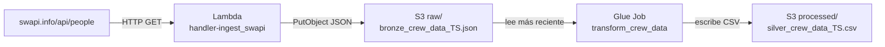
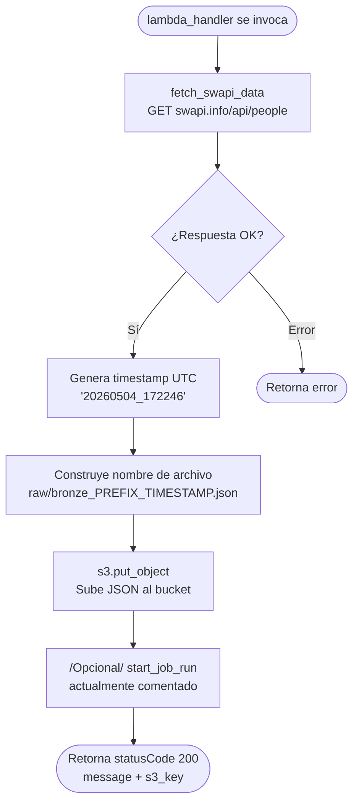
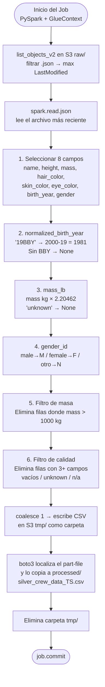
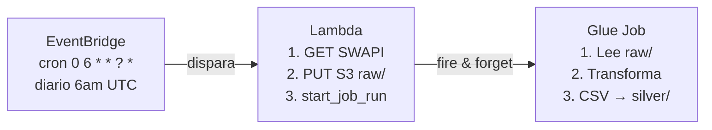
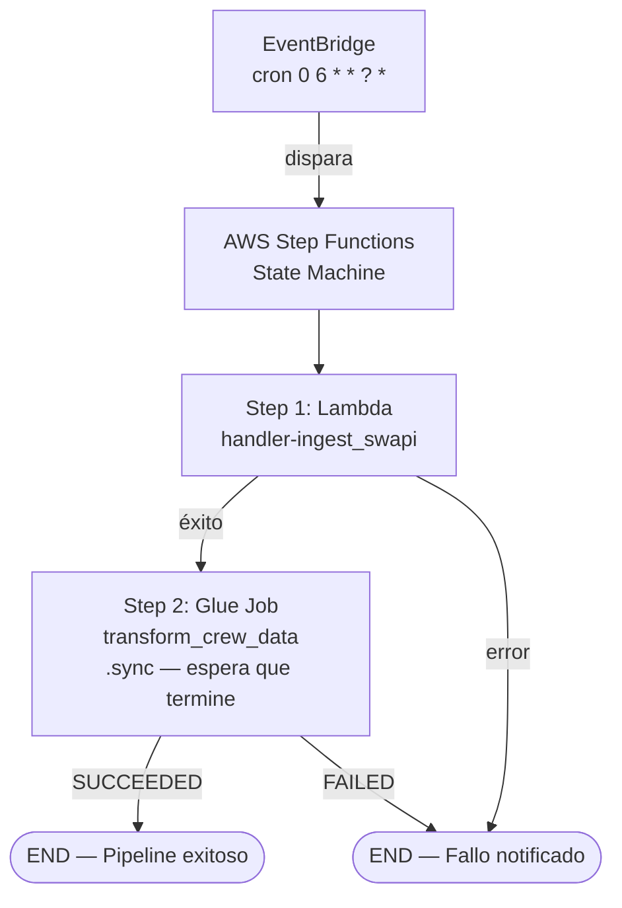

# Galactic Services Data Pipeline — Documentación

## Visión general

Pipeline de datos que extrae información de personajes de Star Wars desde la API pública SWAPI,
la almacena en S3 en formato raw (bronze) y la transforma en un CSV limpio (silver).



## Archivo 1 — `src/lambda/ingest_swapi.py`

### ¿Qué hace?

Esta Lambda es el **punto de entrada del pipeline**. Se ejecuta a demanda y se encarga de:
1. Llamar a la API de SWAPI para obtener los personajes
2. Guardar la respuesta como JSON en S3 en la carpeta `raw/`

### Flujo interno



### Variables de entorno requeridas

| Variable | Descripción | Ejemplo |
|---|---|---|
| `S3_BUCKET` | Nombre del bucket destino | `mi-bucket-datos` |
| `RAW_PREFIX` | Prefijo para el nombre del archivo | `crew_data` |

### Resultado en S3

```
s3://mi-bucket-datos/
└── raw/
    └── bronze_crew_data_20260504_172246.json   ← lista completa de personajes
```

---

## Archivo 2 — `src/glue/transform_crew_data.py`

### ¿Qué hace?

Este Glue Job es el **motor de transformación**. Toma el JSON más reciente de `raw/`,
aplica 6 transformaciones y guarda el resultado como un CSV limpio en `processed/`.

### Parámetros del Job

| Parámetro | Descripción | Ejemplo |
|---|---|---|
| `--JOB_NAME` | Lo inyecta Glue automáticamente | `transform_crew_data` |
| `--S3_BUCKET` | Bucket con los prefijos `raw/` y `processed/` | `mi-bucket-datos` |

### Flujo interno



### Funciones auxiliares

| Función | Propósito |
|---|---|
| `parse_birth_year(by)` | Convierte "19BBY" → "1981", retorna None si no aplica |
| `to_mass_lb(mass_str)` | Convierte kg a libras, maneja "unknown" |
| `to_gender_id(g)` | Mapea género a M/F/N |
| `mass_numeric(mass_str)` | Convierte string de masa a número para filtrar |
| `is_blank(val)` | Detecta valores vacíos, "unknown", "n/a", "null" |

### Resultado en S3

```
s3://mi-bucket-datos/
└── processed/
    └── silver_crew_data_20260504_172246.csv   ← mismo timestamp que el bronze
```

---

## Propuestas de Automatización Diaria

### Opción A — Lambda puro (encadenamiento directo)

La Lambda llama directamente al Glue Job al terminar su trabajo.



**Implementación:** Solo descomentar esta línea en la Lambda:

```python
boto3.client("glue").start_job_run(JobName="transform_crew_data")
```

Y agregar permiso `glue:StartJobRun` al rol IAM de la Lambda.

**Ventajas:**
- Simple de implementar — solo una línea de código
- Menos servicios que configurar
- Sin costo adicional de orquestación

**Desventajas:**
- La Lambda no espera a que termine el Glue Job (dispara y olvida)
- Si el Glue Job falla, la Lambda no se entera — no hay reintento automático
- Difícil de monitorear el pipeline completo como una unidad

---

### Opción B — AWS Step Functions (orquestación)

Step Functions actúa como director de orquesta: coordina la Lambda y el Glue Job,
espera a que cada paso termine antes de continuar y maneja errores automáticamente.



**Implementación:** Se define la State Machine en JSON en la consola de AWS:

```json
{
  "StartAt": "IngestData",
  "States": {
    "IngestData": {
      "Type": "Task",
      "Resource": "arn:aws:states:::lambda:invoke",
      "Parameters": { "FunctionName": "handler-ingest_swapi" },
      "Next": "TransformData",
      "Catch": [{ "ErrorEquals": ["States.ALL"], "Next": "JobFailed" }]
    },
    "TransformData": {
      "Type": "Task",
      "Resource": "arn:aws:states:::glue:startJobRun.sync",
      "Parameters": { "JobName": "transform_crew_data" },
      "End": true,
      "Catch": [{ "ErrorEquals": ["States.ALL"], "Next": "JobFailed" }]
    },
    "JobFailed": {
      "Type": "Fail",
      "Error": "PipelineError",
      "Cause": "Un paso del pipeline falló"
    }
  }
}
```

**Ventajas:**
- Espera a que cada paso termine antes de avanzar (`.sync`)
- Reintento automático configurable por paso
- Historial visual de cada ejecución en la consola de AWS
- Fácil agregar pasos futuros (notificaciones, validaciones, etc.)
- Manejo de errores centralizado

**Desventajas:**
- Más configuración inicial
- Costo adicional por transición de estados (~$0.025 por 1,000 transiciones)
- Requiere un rol IAM adicional para Step Functions

---

## Comparativa

| Criterio | Lambda puro | Step Functions |
|---|---|---|
| Complejidad de setup | Baja | Media |
| Costo | Solo Lambda + Glue | Lambda + Glue + Step Functions |
| Manejo de errores | Manual | Automático |
| Visibilidad del pipeline | Baja | Alta (consola visual) |
| Espera entre pasos | No (fire & forget) | Sí (sincronizado) |
| Escalabilidad futura | Limitada | Alta |
| **Recomendación** | Demos / proyectos simples | Producción |

---

## Estructura del bucket S3

```
s3://mi-bucket-datos/
├── raw/
│   └── bronze_crew_data_20260504_172246.json   ← salida de Lambda
├── processed/
│   └── silver_crew_data_20260504_172246.csv    ← salida de Glue
└── scripts/
    └── transform_crew_data.py       ← script usado por Glue
```

## Implementación con IaC:
Se puede utilizar CloudFormation y crear una plantilla con todo lo que se necesita...